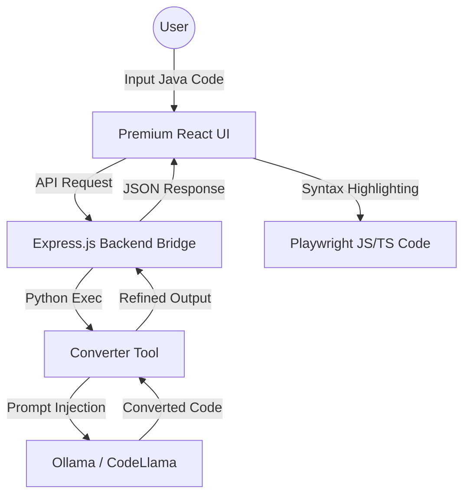

# 🚀 Selenium (Java) to Playwright (JS/TS) Converter

A premium, localized, and intelligent converter designed to transform legacy Selenium Java (TestNG) tests into modern, idiomatic Playwright JavaScript or TypeScript. Powered by **Local LLMs (CodeLlama via Ollama)** for maximum privacy and accuracy.

---

## 🏗️ Architecture (A.N.T. Protocol)

The system follows the **A.N.T.** (Architecture, Navigation, Tools) 3-layer methodology to ensure deterministic results from probabilistic models.



---

## ✨ Features

- **Readability First:** Prioritizes idiomatic Playwright patterns (e.g., `test.beforeEach`, `page.getByRole`) over literal 1:1 translation.
- **Real-Time Highlighting:** Dual-pane editor with PrismJS syntax highlighting for both Java and Typescript.
- **Local Privacy:** No code leaves your machine. All conversions are handled by your local Ollama instance.
- **A.N.T. Framework:** Built with structural integrity using documented SOPs.
- **Synchronized Scroll:** Seamless comparison between source and converted code.

---

## 🛠️ Prerequisites

1.  **Node.js (v14.16.0+):** To run the React UI and Express bridge.
2.  **Python (3.9+):** To run the conversion logic.
3.  **Ollama:** Install from [ollama.ai](https://ollama.ai).
4.  **CodeLlama:** Run `ollama pull codellama` to download the model.

---

## 🚀 Setup & Installation

### 1. Clone the Repository
```bash
git clone https://github.com/roshrv27/proj2_sel_to_playwright_coverter.git
cd proj2_sel_to_playwright_coverter
```

### 2. Install Dependencies
```bash
# Install Python requirements
pip install requests

# Install UI & Bridge requirements
cd web_ui
npm install
```

---

## 🚦 Usage

### 1. Start the Backend Bridge
In one terminal, start the Express server that routes requests to the Python tool:
```bash
cd web_ui
PORT=3001 node server.js
```

### 2. Start the Frontend UI
In a second terminal, launch the premium React interface:
```bash
cd web_ui
npm start
```

### 3. Convert Code
- Open **[http://localhost:8080](http://localhost:8080)**.
- Paste your Selenium Java code into the left pane.
- Click the **Zap button** to trigger the CodeLlama conversion.
- Copy your refined Playwright code from the right pane.

---

## 📝 Maintenance & Constitution
The project is governed by the `gemini.md` (Project Constitution) and the `task_plan.md`. Every major structural change is logged in the **Maintenance Log** within `gemini.md` to ensure long-term stability.

---

## 🛡️ Protocol
Developed using the **B.L.A.S.T.** (Blueprint, Link, Architect, Stylize, Trigger) protocol for world-class AI agentic coding.
